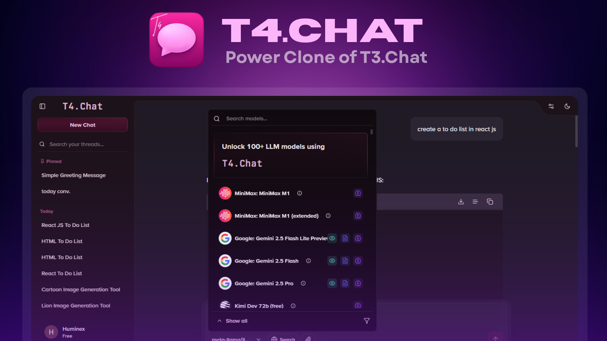

# T4 Chat - Power Clone of T3.Chat



**🌐 Live Demo:** [https://t3dotchat-clone.vercel.app/](https://t3dotchat-clone.vercel.app/)

A powerful, feature-rich clone of [t3.chat](https://t3.chat) with advanced AI capabilities and seamless tool integration.

## ✨ Key Features

- **🔧 Dynamic Tool System** - Add any tool dynamically (image generation, web search, etc.)
- **🎨 Pixel-Perfect UI** - Consistent design with precise attention to detail
- **🧠 Smart Prompt Engineering** - Optimized AI behavior for relevant responses
- **🔗 OpenRouter Integration** - Effortless access to multiple LLM models
- **🤖 100+ LLM Models Access** - Wide variety of AI models for different use cases

## 🚀 Getting Started

### Prerequisites

- Node.js 18+, MongoDB, Google OAuth credentials

### Quick Setup

1. **Clone & Install**

   ```bash
   git clone https://github.com/Huminexdotco/t3dotchat-clone.git
   cd t3dotchat-clone
   npm install
   ```

2. **Environment Variables** - Create `.env.local`:

   ```env
   Add all the environment variables from the .env.example file
   ```

3. **Run**
   ```bash
   npm run dev
   ```
   Open [http://localhost:3000](http://localhost:3000)

### Build for Production

```bash
# Build the application
npm run build

# Start the production server
npm start
```

### Environment Variables Reference

| Variable                       | Description                                | Required |
| ------------------------------ | ------------------------------------------ | -------- |
| `AUTH_SECRET`                  | Secret key for NextAuth.js                 | ✅       |
| `MONGODB_URI`                  | MongoDB connection string                  | ✅       |
| `AUTH_GOOGLE_ID`               | Google OAuth client ID                     | ✅       |
| `AUTH_GOOGLE_SECRET`           | Google OAuth client secret                 | ✅       |
| `PERSONAL_EMAIL`               | Email address for sending emails           | ✅       |
| `EMAIL_PASSWORD`               | App password for email service             | ✅       |
| `NEXT_PUBLIC_APP_URL`          | Base URL of the application                | ✅       |
| `GOOGLE_GENERATIVE_AI_API_KEY` | API key for Google's Generative AI         | ✅       |
| `GEMINI_API_KEY`               | API key for Google's Gemini                | ✅       |
| `TAVILY_API_KEY`               | API key for Tavily search                  | ✅       |
| `NEXT_PUBLIC_CLOUDINARY_*`     | Cloudinary configuration for media uploads | ✅       |
| `OPEN_ROUTER_REDIRECT_URI`     | Callback URL for OpenRouter OAuth          | ✅       |
| `CODE_VERIFIER`                | Secret key for OpenRouter                  | ✅       |
| `SECRET_KEY`                   | Application secret key                     | ✅       |

## 🤝 Contributing

1. Fork → Create branch → Commit → Push → Pull Request
2. We're committed to continuous improvement!

## 📄 License

This project is licensed under the MIT License - see below for details:

```
MIT License

Copyright (c) 2025 T4 Chat

Permission is hereby granted, free of charge, to any person obtaining a copy
of this software and associated documentation files (the "Software"), to deal
in the Software without restriction, including without limitation the rights
to use, copy, modify, merge, publish, distribute, sublicense, and/or sell
copies of the Software, and to permit persons to whom the Software is
furnished to do so, subject to the following conditions:

The above copyright notice and this permission notice shall be included in all
copies or substantial portions of the Software.

THE SOFTWARE IS PROVIDED "AS IS", WITHOUT WARRANTY OF ANY KIND, EXPRESS OR
IMPLIED, INCLUDING BUT NOT LIMITED TO THE WARRANTIES OF MERCHANTABILITY,
FITNESS FOR A PARTICULAR PURPOSE AND NONINFRINGEMENT. IN NO EVENT SHALL THE
AUTHORS OR COPYRIGHT HOLDERS BE LIABLE FOR ANY CLAIM, DAMAGES OR OTHER
LIABILITY, WHETHER IN AN ACTION OF CONTRACT, TORT OR OTHERWISE, ARISING FROM,
OUT OF OR IN CONNECTION WITH THE SOFTWARE OR THE USE OR OTHER DEALINGS IN THE
SOFTWARE.
```

## 🆘 Support

- GitHub Issues
- Website Contact
- Documentation

---

Built with ❤️ by the Huminex team developer [Devyansh](https://x.com/DevyanshYadavv) and [Aasu](https://x.com/Aasuyadavv)
